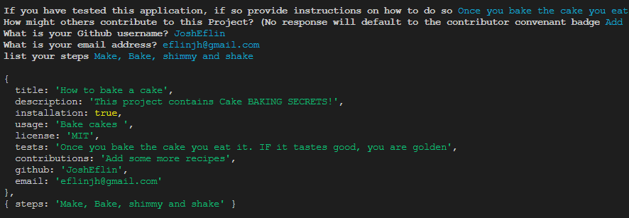
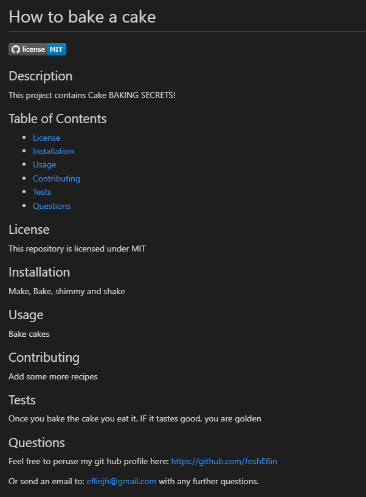

# Node-ReadMe-Generator
`

## Description

This repository contains code for a simple README generator designed to free up time for developers to work on what really matters: The code.
It's a CLI that takes in user responses and users string template literals to create a markdown file. 

## Usage
 Feel free to use this readme generator to generate your own README.md files.

 
 

 ## REPO
 https://github.com/JoshEflin/Node-ReadMe-Generator